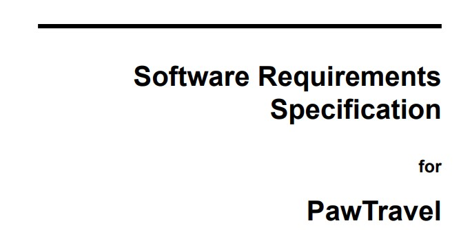
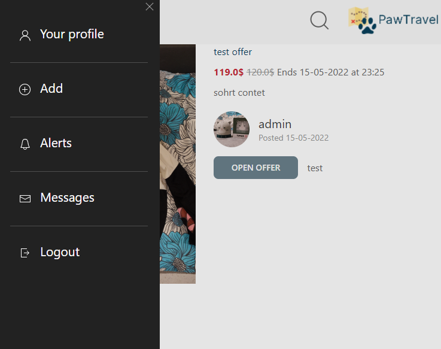
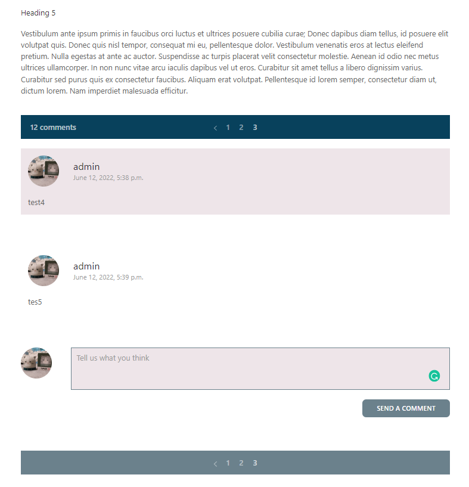

# PawTravel
The purpose of this project was to create a website which allows its users to find travel offers as well as post their own.

The project's functionality is based around offers related to traveling. Therefore, the main functionalities available to the users are:
* Browsing existing offers
* Filtering offers to match user criteria
* Posting offers found by the user
* Rating offers of other users

## Specification

Application Specification (<a href="docs/reports/specification.pdf">click to view</a>).

## Team
* [Dawid Grobert](https://github.com/Notiooo)
* [Julia Boczkowska](https://github.com/JuliaBoczkowska)
* [Michał Zieliński](https://github.com/michalzielinski913)
* [Rafał Synoradzki](https://github.com/Morticzek)
* [Bartosz Ryczek](https://github.com/bartryc570)
* [Daniel Marek](https://github.com/danielmarek22)

## Sample Screenshots

### Homepage, and offers

 

### Responsive offer design

 

### Responsive travel guide design

 

### Adapted for mobile devices

 

### Comment system

 